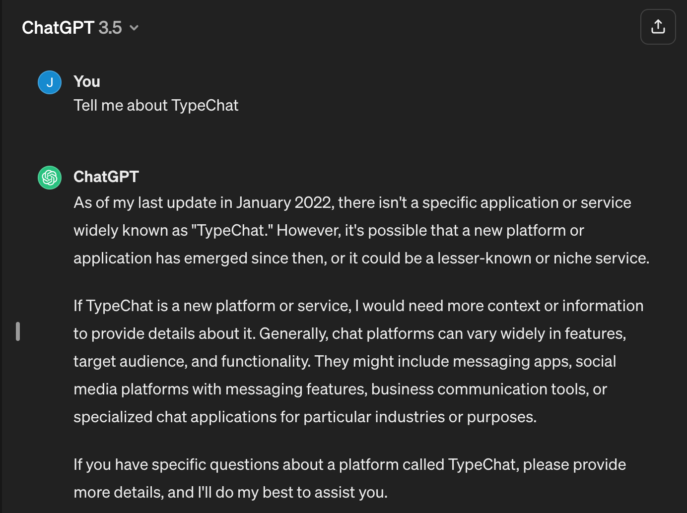
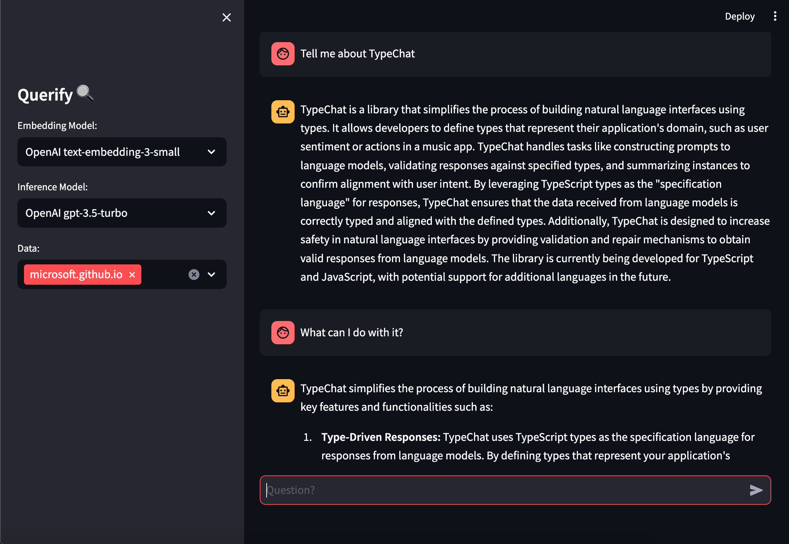

# questionable

A RAG (Retrieval-augmented generation) based chatbot for querying (e.g. private) domain-specific information, unknown to generic LLMs (large language model), using LLamaIndex framework and ChromaDB vector database. Currently, embedding and inference models in use are from OpenAI via API. Check [results](#results) to see it in action.

### Initialize

##### Create `.streamlit/secrets.toml` file with following contents:
```
OPENAI_API_KEY = "<OPENAI_API_KEY>"
```

##### Fetch data
Download the datasets from https://github.com/juhajokela/AI-data/tree/main/data and put to "data" directory in the project root.

##### Run following command(s):
NOTE! Must be run from the project root directory!
```
./docker-scripts/docker-build.sh
```

### Run
NOTE! Must be run from the project root directory!
```
./docker-scripts/docker-dev.sh
```

### Results

TypeChat was released on July 20, 2023 (https://microsoft.github.io/TypeChat/blog/introducing-typechat/).





### References

Streaming Responses
- https://docs.llamaindex.ai/en/stable/module_guides/deploying/chat_engines/root.html
- https://docs.llamaindex.ai/en/stable/examples/customization/streaming/chat_engine_condense_question_stream_response.html
- https://docs.llamaindex.ai/en/stable/module_guides/deploying/query_engine/streaming.html

Persisting Index
- https://docs.llamaindex.ai/en/stable/understanding/storing/storing.html

Scraper
- https://docs.scrapy.org/en/latest/intro/tutorial.html
- https://docs.scrapy.org/en/latest/topics/practices.html

Vector Database
- https://docs.llamaindex.ai/en/stable/module_guides/storing/vector_stores.html
    - https://www.trychroma.com/
    - https://docs.llamaindex.ai/en/stable/examples/vector_stores/AzureCosmosDBMongoDBvCoreDemo.html

### TODO

- combine documents / indexes
    - https://docs.trychroma.com/reference/Collection#add
    - https://docs.llamaindex.ai/en/stable/understanding/storing/storing.html#inserting-documents-or-nodes
- add Hugging Face LLMs: inference & embedding
    - https://docs.llamaindex.ai/en/stable/examples/customization/llms/SimpleIndexDemo-Huggingface_camel.html
    - https://docs.llamaindex.ai/en/stable/examples/customization/llms/SimpleIndexDemo-Huggingface_stablelm.html
    - embedding with all-MiniLM-L6-v2
        - https://stackoverflow.com/questions/76618655/hardware-requirements-for-using-sentence-transformers-all-minilm-l6-v2
- optimize model temperature setting
- scrape: llamaindex, scrapy, trafilatura, python docs, chromadb
- show references (e.g. url to the original material)
- parallelize scrapy - to make it go faster
- integrate web scraper to the UI
